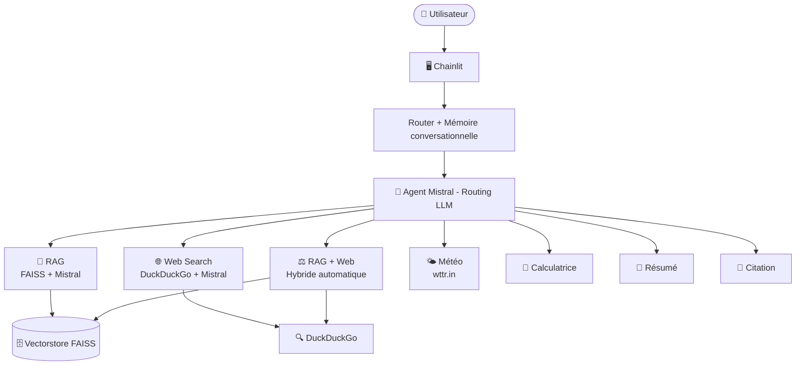

# ⚖️ Aequitas — Assistant Juridique Intelligent

Aequitas est un assistant conversationnel spécialisé en **Droit Pénal International**.

Il combine un pipeline **RAG** (Retrieval-Augmented Generation) sur des documents juridiques et un système d'**agents intelligents** capables d'appeler des outils externes selon le contexte de la question.

---

## 🏗️ Architecture



---

## 📁 Structure du projet

```
Gen AI/
├── src/
│   ├── app_chainlit.py          # Interface Chainlit + gestion images (Pixtral)
│   ├── memory.py                # Mémoire conversationnelle
│   ├── agent/
│   │   └── agent.py             # Agent Mistral + routing intelligent
│   ├── rag/
│   │   ├── rag_chain.py         # Pipeline RAG (FAISS + Mistral)
│   │   └── build_rag_pipeline.py # Indexation des documents
│   └── tools/
│       ├── calculator.py        # Calcul mathématique
│       ├── weather.py           # Météo (wttr.in)
│       ├── web_search.py        # Recherche web (DuckDuckGo + Mistral)
│       ├── summarizer.py        # Résumé de texte juridique
│       └── citation_formatter.py # Formatage de citations académiques
├── router.py                    # Router principal
├── data/
│   └── vectorstore/             # Index FAISS (généré)
├── requirements.txt
├── config.yaml
└── .env
```

---

## 🛠️ Outils disponibles

| Outil | Déclenchement | Description |
|-------|--------------|-------------|
| 📄 **RAG** | Questions juridiques théoriques | Recherche dans les documents indexés |
| 🌐 **Web Search** | Actualités, personnes, événements récents | DuckDuckGo + synthèse Mistral |
| ⚖️ **RAG + Web** | RAG insuffisant | Hybride automatique |
| 🌤️ **Météo** | Questions météo | API wttr.in (sans clé) |
| 🔢 **Calcul** | Opérations mathématiques | Extraction + eval sécurisé |
| 📝 **Résumé** | "Résume...", "synthétise..." | Résumé en points clés via Mistral |
| 📌 **Citation** | "Formate...", "cite..." | Standards académiques internationaux |

---
## 📦 Dépendances principales

| Package | Rôle |
|---------|------|
| `langchain` + `langchain-mistralai` | Pipeline RAG et agents |
| `faiss-cpu` | Vectorstore pour l'indexation des documents |
| `chainlit` | Interface conversationnelle |
| `ddgs` | Recherche web DuckDuckGo |
| `beautifulsoup4` | Extraction du contenu des pages web |
| `python-dotenv` | Gestion des variables d'environnement |
| `pdfplumber` + `python-docx` | Lecture des documents PDF et DOCX |
| `pyyaml` | Lecture du fichier de configuration |

> Le fichier complet est disponible dans `requirements.txt`

---
## ⚙️ Prérequis

- Python 3.10+
- pip
- Une clé API Mistral (gratuite sur [console.mistral.ai](https://console.mistral.ai))

---

## 🚀 Installation

### 1. Cloner le dépôt

```bash
git clone https://github.com/ConstanceKEITA/Projet_Generative_AI.git
cd Projet_Generative_AI
```

### 2. Installer les dépendances

```bash
pip install -r requirements.txt
```

### 3. Configurer la clé API Mistral

Crée un fichier `.env` à la racine du projet :

```bash
cp .env.example .env
```

Puis remplis `.env` avec ta clé :

```
MISTRAL_API_KEY=ta-clé-mistral
```

> ⚠️ Ne commite jamais le fichier `.env` sur GitHub. Il est déjà dans le `.gitignore`.

### 4. Indexer les documents

Place tes documents PDF/DOCX dans le dossier `data/documents/` puis lance :

```bash
PYTHONPATH=. python src/rag/build_rag_pipeline.py
```

Cela génère l'index FAISS dans `data/vectorstore/`.

### 5. Lancer l'application

```bash
PYTHONPATH=. chainlit run src/app_chainlit.py
```

Ouvre ensuite [http://localhost:8000](http://localhost:8000) dans ton navigateur.

---

## 💬 Exemples d'utilisation

```
# Question juridique (RAG)
"Qu'est-ce que le principe de distinction ?"
"Que dit l'article 3 commun aux Conventions de Genève ?"

# Actualité (Web Search)
"Quel est le statut du mandat d'arrêt de la CPI contre Poutine ?"
"Netanyahou a-t-il été arrêté ?"

# Météo
"Quelle est la météo à Genève ?"

# Calcul
"Combien font 1945 + 79 ?"

# Résumé
"Résume l'article 51 du Protocole additionnel I"

# Citation
"Formate la citation : Convention de Genève III, article 17, 1949"
```

---

## 🧠 Fonctionnalités clés

- **Routing intelligent par LLM** — Mistral choisit automatiquement le bon outil
- **Logique hybride RAG + Web** — bascule sur le web si le RAG est insuffisant
- **Mémoire conversationnelle** — conserve le contexte de la conversation
- **Gestion d'images** — analyse d'images via Pixtral (modèle vision Mistral)
- **Cache RAG** — le vectorstore est chargé une seule fois pour de meilleures performances
- **Sources citées** — toutes les réponses RAG et Web affichent leurs sources

---

## 🤝 Contributeurs

- Alejandro SOBRINO
- Ivan WINOGRAD
- Constance KEITA
